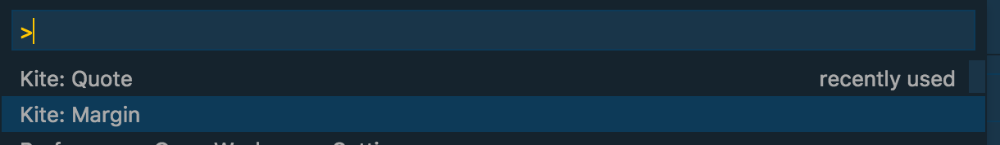
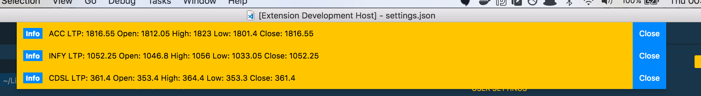
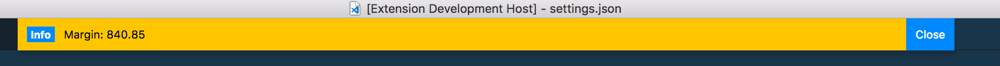

# vscode-kite README

## Features

* Fetch stock data
* Fetch available margin

## Requirements

`npm install --save kiteconnect`

## Extension Settings

This extension contributes the following settings:

* `vscode-kite.symbols`: [] // array of stocks for which LTP, OHLC data can be fetched
* `vscode-kite.access_token`: str // kite api access token
* `vscode-kite.api_key`: str // kite api key
