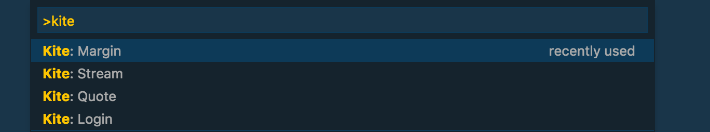

# vscode-kite

https://marketplace.visualstudio.com/items?itemName=mrkaran.vscode-kite

## Features

* Fetch quote data for the given list of stocks.
* Fetch available margin in your Kite account.
* Fetch live market prices through websocket support.





## Requirements

`npm install --save kiteconnect`

## Extension Settings

This extension contributes the following settings:

* `vscode-kite.symbols: [] // array of tradingsymbols for which LTP and OHLC data can be fetched`
* `vscode-kite.api_key: str // kite api key`
* `vscode-kite.request_token: str // kite api access token`
* `vscode-kite.api_secret: str // kite api secret`
* `vscode-kite.live_stocks: [] // array of instrument tokens to fetch realtime data`

### Sample Configuration

```
{
    "vscode-kite.symbols": [
        "INFY",
        "ACC",
        "RELIANCE",
        "CDSL"
    ],
    "vscode-kite.api_key": "",
    "vscode-kite.live_stocks": [738561, 408065],
    "vscode-kite.api_secret": "",
    "vscode-kite.request_token": ""
}
```

